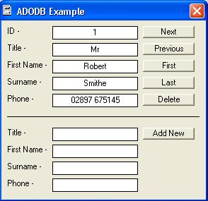



## ADODB Example \- Connect To Access Database

### Description

Example shows how to connect to an Access database; browse, add, and delete records.
 
### More Info
 

             |
---                |---
**Submitted On**   |2004-11-24 20:59:08
**By**             |[Mark Howard](https://github.com/Planet-Source-Code/PSCIndex/blob/master/ByAuthor/mark-howard.md)
**Level**          |Beginner
**User Rating**    |4.9 (34 globes from 7 users)
**Compatibility**  |VB 6\.0
**Category**       |[Databases/ Data Access/ DAO/ ADO](https://github.com/Planet-Source-Code/PSCIndex/blob/master/ByCategory/databases-data-access-dao-ado__1-6.md)
**World**          |[Visual Basic](https://github.com/Planet-Source-Code/PSCIndex/blob/master/ByWorld/visual-basic.md)
**Archive File**   |[ADODB\_Exam18218211252004\.zip](https://github.com/Planet-Source-Code/mark-howard-adodb-example-connect-to-access-database__1-57415/archive/master.zip)

